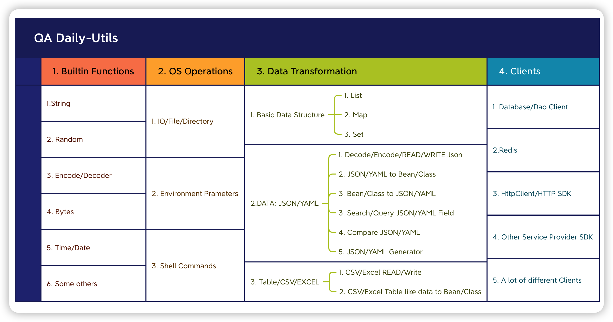

# README

Python Libs for QA

## Overview

## Python Template project

- [python-project-template](https://github.com/fluent-qa/fluent-pypro-template.git)

* Usage:

```sh
cookiecutter https://github.com/qdriven/fluent-pypro-template.git
```
## Python libs

Python Lib is for QA Daily Usage:



- [fluentqa-pytpl](https://github.com/fluent-qa/fluent-pypro-template.git) easy to setup project
- [fluentqa-base](https://github.com//fluent-qa/fluentqa-pybase.git) builtin toolkits and different tips
- [fluentqa-qpydao](https://github.com/fluent-qa/fluentqa-pdao/) easy to access database
- [fluentqa-qone](https://github.com/qdriven/fluentqa-pyutils.git/) all-in-one project to quick make backend api
- [fluentqa-plugin](./fluentqa-plugins/) plugins for pytest

## Python Daily Tools 

- [fluentqa-helper](./fluentqa-helper/) Easy API Capture Tools


## Python Clients

## Python DI/IoC

## Python Plugins

## Python Workflow/Runner

## Awesome Python
- [todo-arch](https://github.com/Raghav2211/todo-app-infra.git)
- [todo-app](https://github.com/heikkilamarko/todo-app.gits)
