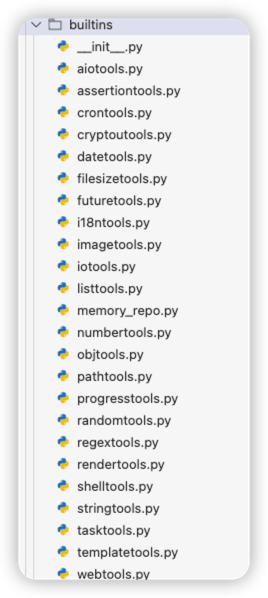

# README

FluentQA Python is a collection of python libs used for QA daily work. 

- Overview:

## Packages included

- [fluentqa-pytpl](https://github.com/fluent-qa/fluentqa-pytpl.git) create poetry based template project

- [fluentqa_base](https://github.com/fluent-qa/fluentqa-pybase.git) base python libs used for QA

- [fluentqa-dao](https://github.com/fluent-qa/fluentqa-dao.git) database operations libs

- [fluentqa-models](https://github.com/fluent-qa/fluentqa-models.git) handle structured data in python

- [fleuntqa-helper](https://github.com/fluent-qa/fluentqa-helper.git)helper utility to do testing
